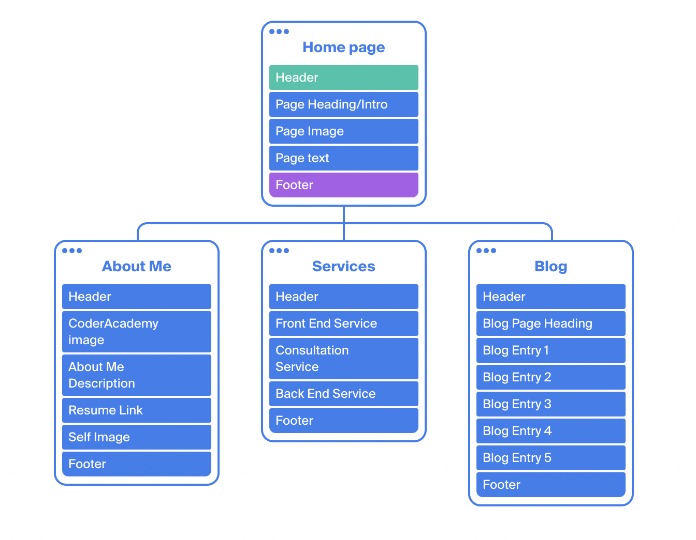
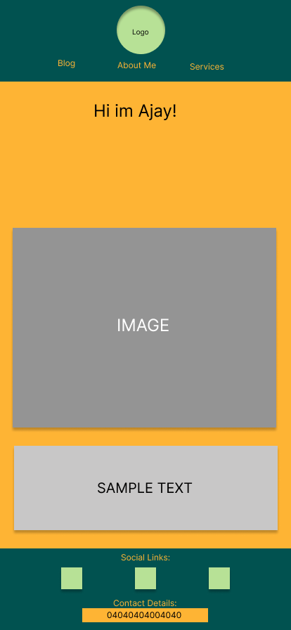
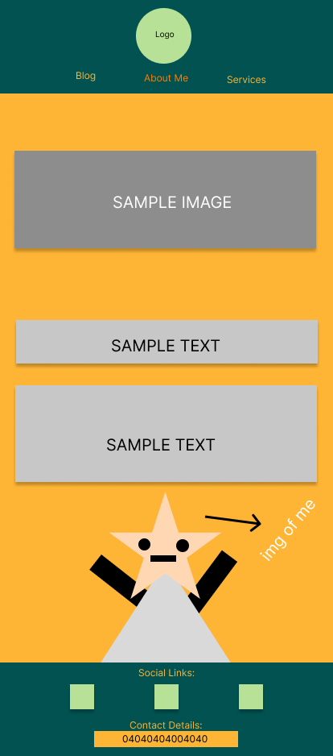
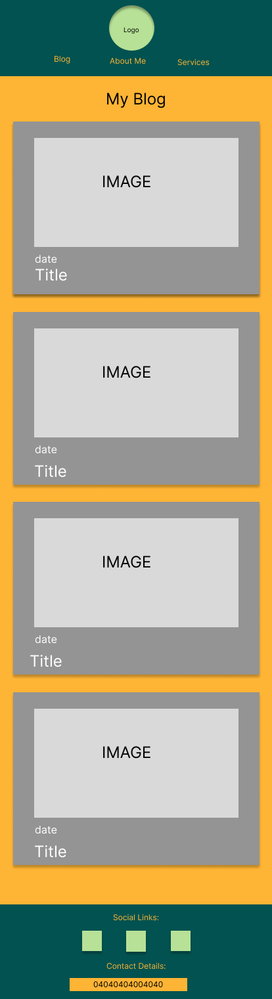
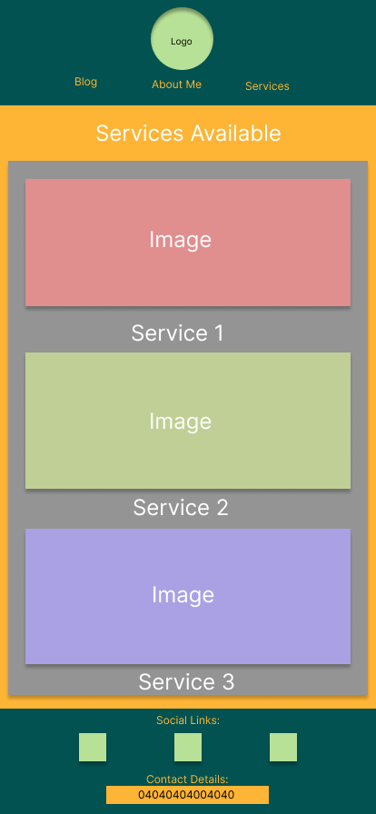

# AjayArcher_T1A2

## Overview 
This is a portfolio website which presents myself as a developer and an IT professional. The website is aimed at a hypothetical employer searching for a skilled dev and/or IT professional 

## Website Components 

### Header 
The header contains a navigation bar with three links to an About Page, Services Page and a Blog Page. It also has a smiley face logo which links back to the Home Page. The Header has been styled so that the nav items are in the middle with the logo above on Mobile devices, otherwise the logo will move to the left side and the navbar items will move to the right side. All Header items will change color when hovered over. The logo has been animated so that it rotates when hovered over.

### Footer  
The footer contains links to Github, Linkedin and Instagram. There is also Contact information, presenting a mock phone number and address. The footer has been styled in a responsive way which changes the way which the social links are presented depending on what device your viewing it on. 

## Pages 

### Home Page 
The Home page contains a page heading, placeholder image and text. The formatting of the image and text will change to a more pleasing layout depending on the device used.

### About Me Page  
The About Me Page Contains basic information on myself, a link to a mock resume, An image of myself and the coder academy logo. The page has been styled so that the image of myself comes from the footer with the resume link above. The Resume link button has been styled so that it changes color when hovored over.

### Blog Page
The Blog Page contains five sample blog posts with a page heading, image, title and lorem text for each. The blog articles have different text colors for The date, title and description to easily differentiate them. The images have been given borders which continue down to create the text box. 

### Services Page 

The Services Page contains three services: Front end deveopement, website design consultation and back end developement. The services have an image, title amd lorem text for each. The Services page has been styled so that depending on the device used the services will change from aligning themselves vertically to horizontally. The images are highlighted with a blue border when hovered over on desktop view.  

## Design  

### Colours 

I chose to use the colours Jade Green, a warm yellow and a vibrant orange. The yellow and orange bring a sunset to mind and makes the site appear bright and happy. The moody green contrasts that and draws attention to key features.  

## Links 

### Website Link 
[Published Website](ajayportfoliot1a2.netlify.app)

### Github 
[Github Repository](https://github.com/AjayArcher23/AjayArcher_T1A2) 

